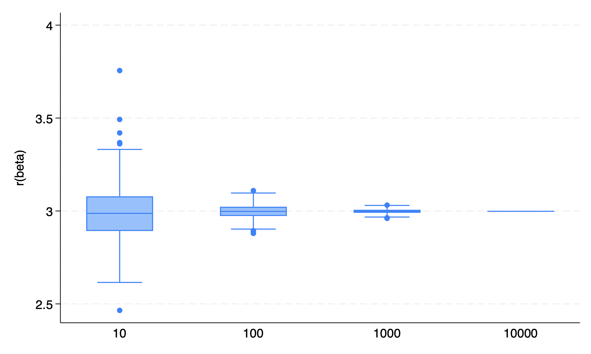
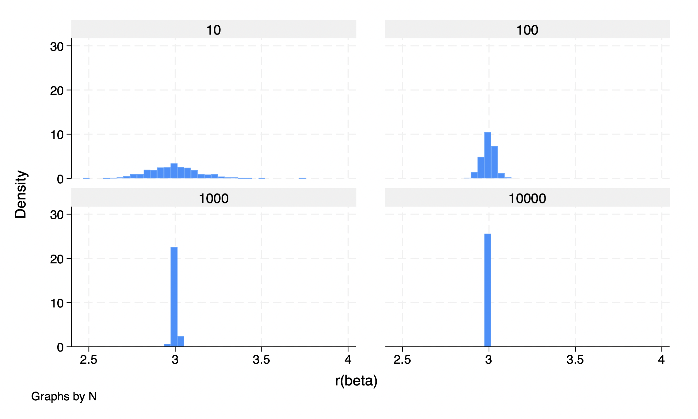

## STATA 3

## PART 1 
We see that as N increases the variation in the beta estimates reduces. Moreover, the confidence intervals and SEM reduce as N increases.
 

This can also be seen with histogram for the different levels of N
 
