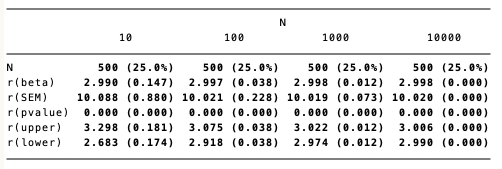

## STATA 3

## PART 1 
Overall we see that increasing the sample size increases the precision of beta estimates, reduces standard errors, and narrows confidence intervals. This can be seen in the graphs and table below.

In the boxplot below, we see that as N increases the variation in the beta estimates reduces. The interquartile range decreases substantially as N increases from 10 to 1000, showing that beta estimates are more accurate with larger samples. Moreover, the smaller sample sizes have more outliers (points beyond the whiskers).

 

This is also represented in the histogram below, whereby it can be seen that N increases, the distribution goes from being spread around the mean to tall and narrow (N=1000).

 

Finally, in the table below we see that the confidence interval narrows as N gets larger and that the standard error of the beta estimates reduces significantly as the sample size increases.

 

## PART 2
